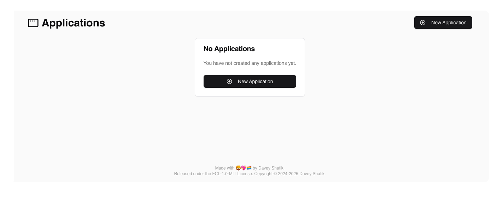
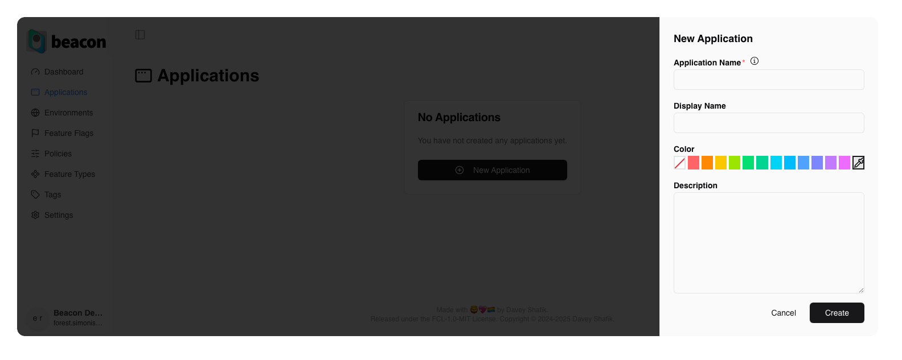
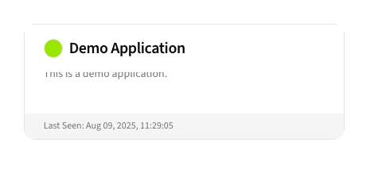
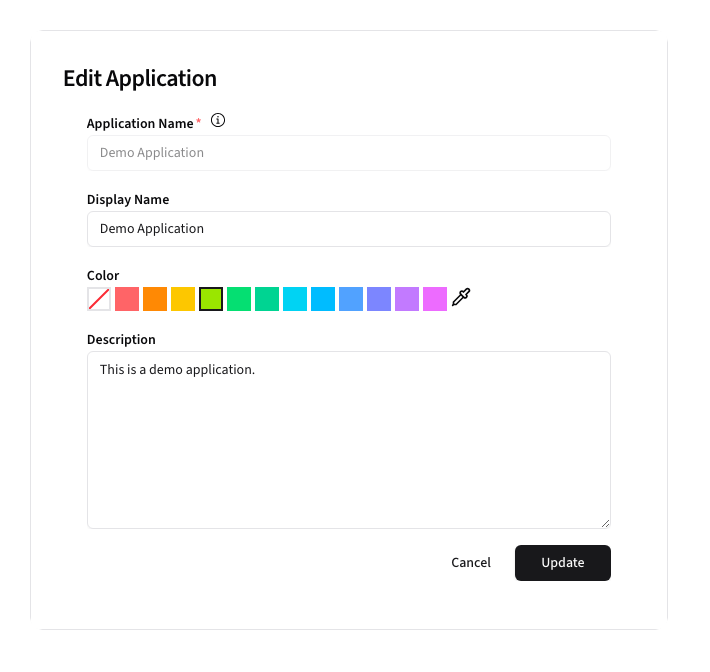

# Applications

The Applications section allows users to manage and configure your Laravel applications.

## Overview

## Creating Applications

To create a new Application, click the <kbd><CirclePlus /> New Application</kbd> button.

**Form Fields:**
- **Name**: Unique application identifier, typically the same as your `APP_NAME`.
- **Display Name**: A friendly display name that can be changed
- **Description**: Description of the application
- **Color**: A color to help identify the Application elsewhere in Beacon

After creating a new application, it will show up in the Application list:

The application card will display any environments for which feature flag configurations exist.

## Editing Applications

To edit an application, click the card in the list.

> [!NOTE]
> The Application Name cannot be changed, and must match your applications 
> `pennant.stores.beacon.app_name` configuration setting.
