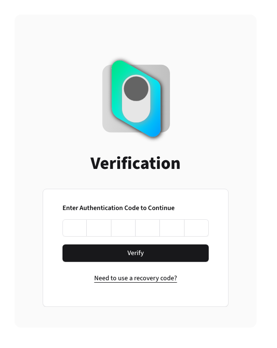
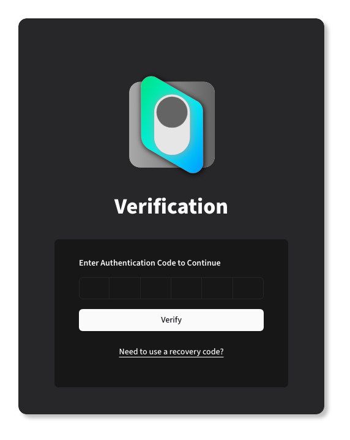
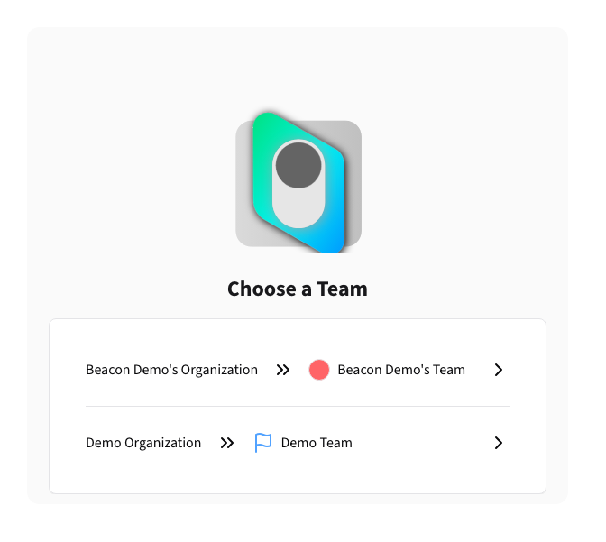
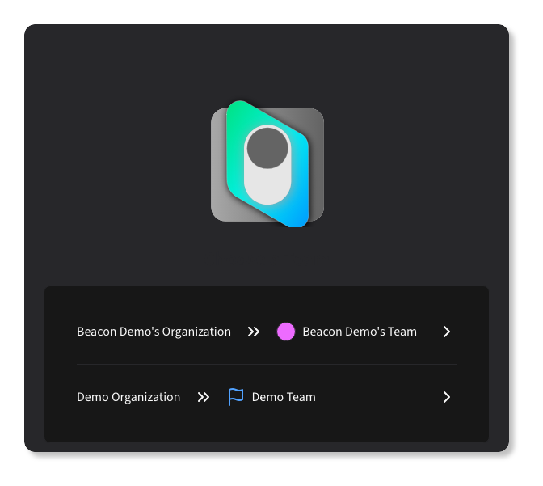

# Logging In

{.light-only}
{.dark-only}

Beacon requires all users use two-factor authentication (2FA) to log in.

{.light-only}
{.dark-only}

Additionally, if you belong to more than one team or organization, you will be prompted to select which one you want to access:

{.light-only}
{.dark-only}
