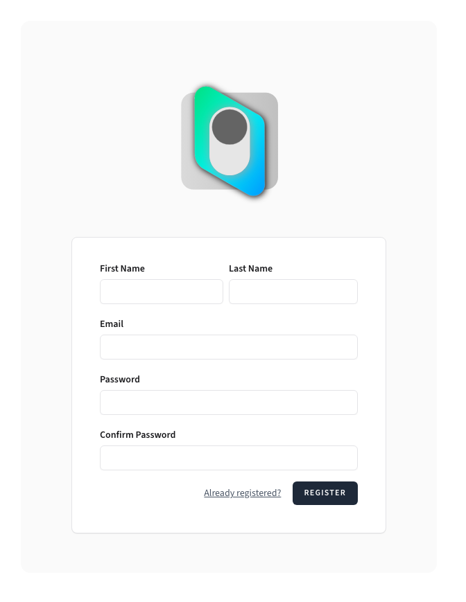
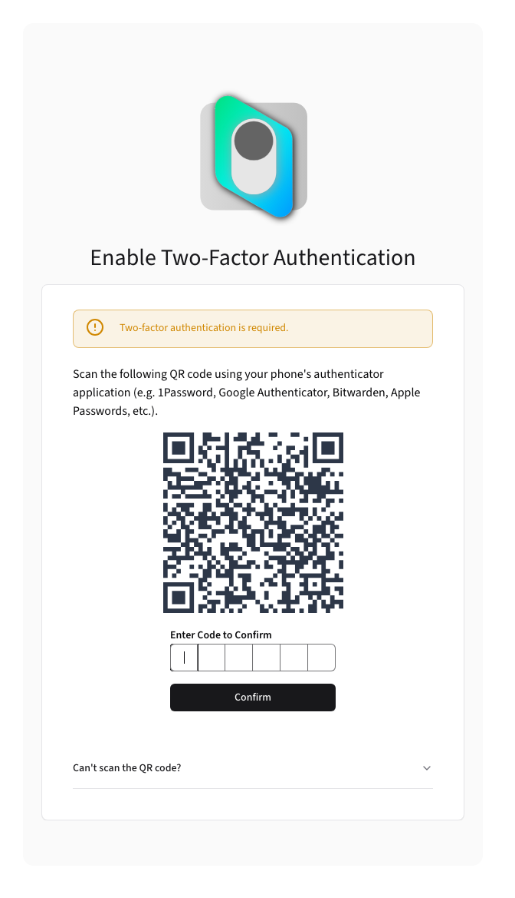
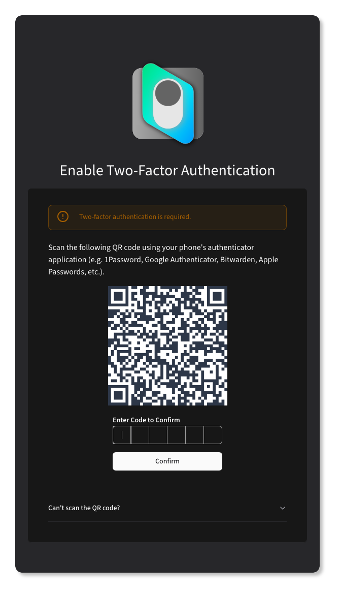
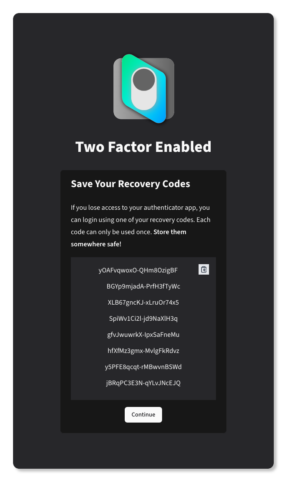

# Creating an Account

If you are creating a new account without an invitation, Beacon will automatically create a new Organization and Team for you. You can
always be added to additional Organizations and Teams later.

{.light-only}
{.dark-only}

To create an account, fill out the registration form, then confirm your email address:

{.light-only}
{.dark-only}

Once your email is confirmed you will be prompted to set up two-factor authentication:

{.light-only}
{.dark-only}

> [!NOTE]
> Two-factor authentication is required for all accounts.

Finally, you will be prompted to store your recovery codes. These codes are essential for account recovery if you lose access to your two-factor authentication method:

{.light-only}
{.dark-only}

After completing these steps, you will be logged in and can start using the application.
