# Dashboard

The Dashboard is the main landing page of the Beacon application, providing an overview of feature flag metrics.

## Overview

The Dashboard displays key metrics and visualizations to help teams monitor their feature flag usage and health. It includes metric cards, charts, data tables, and an onboarding flow for new users.

Metrics are updated approximately every 60 seconds.

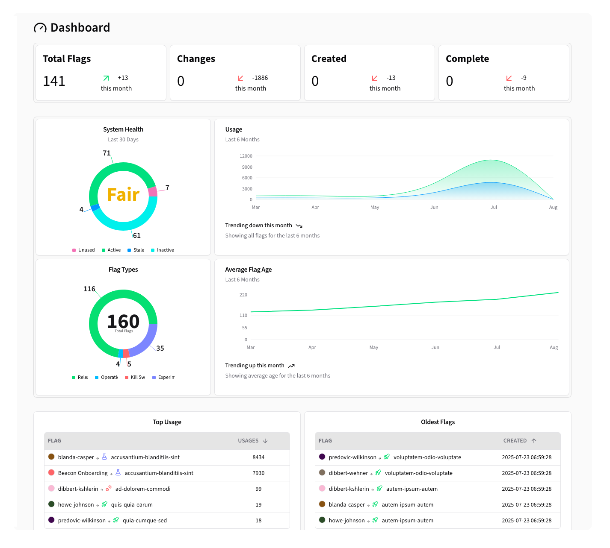

## Onboarding Dialog

If you are new to Beacon, you will be greeted with a dialog that guides you through the setup process.

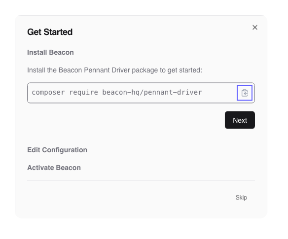

First, you will need to install the Beacon Pennant driver using [Composer](https://getcomposer.org), click the <kbd>Next</kbd> button to proceed.

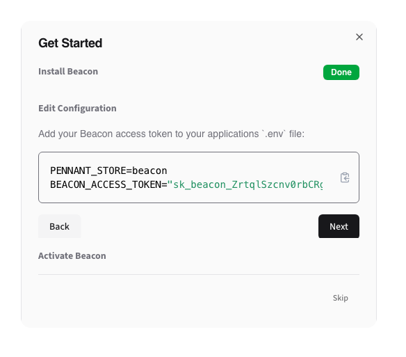

Next, you will be prompted to add the environment variables to add to your `.env` file. Click the <kbd>Next</kbd> button to proceed.

Finally, Beacon will guide you through testing the integration is functional, using cURL, httpie, or Pennant.

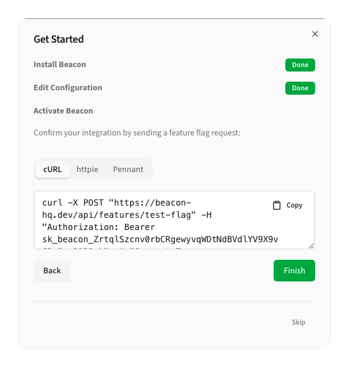

Once Beacon receives an evaluation request, you can click the <kbd>Finish</kbd> button to complete the onboarding.

> [!TIP]
> If you are already familiar with Beacon setup, or have completed it manually, you can click <kbd>Skip</kbd> to hide it going forward. 

## Metrics

The dashboard displays key metrics for your team:

### Total Flags

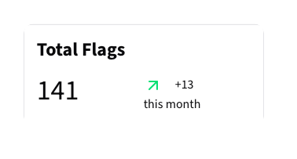

The total number of flags, as well as the difference from last month.

### Changes This Month

The number of changes this month — this includes the number of newly created flags, deleted flags, and any changes to the flags
settings or configuration.

### Created This Month

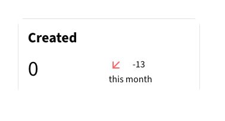

The number of flags created this month, as well as the difference compared to the number created in the previous month.

### Completed This Month

The number of feature flags marked as Completed this month, as well as the difference compared to the number completed in the previous month. 

### Health Scorecard

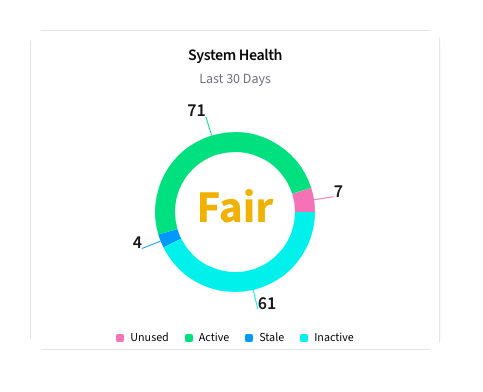

The Health Score is an at-a-glance metric that determines the overall health of your
feature flags. It measures the number of active flags vs the number of unused, stale, and inactive flags.

Possible Health Scores are:

- Excellent
- Good
- Fair
- Poor
- Critical

### Flag Types

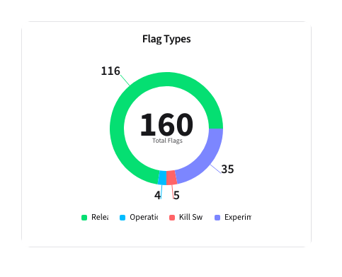

The distribution of feature flag types.

### Usage

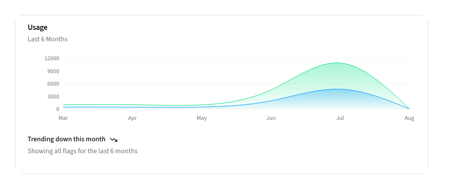

This graph shows the number of feature flag evaluations over time, and 
their active/inactive result.

### Average Flag Age

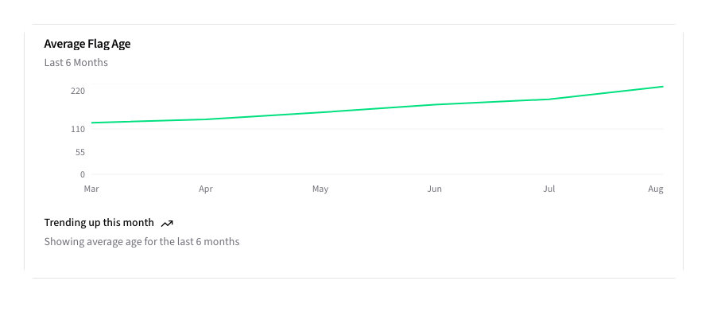

Line chart showing the average age of your feature flags over time.

## Data Tables

### Most Used Flags

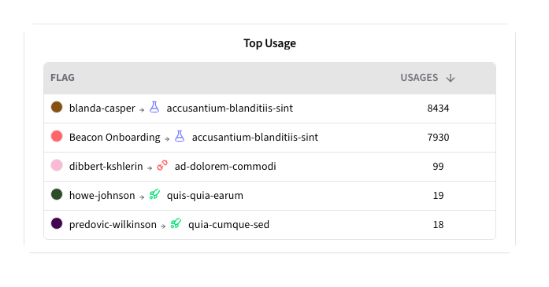

A list of the most evaluated flags.

### Oldest Flags

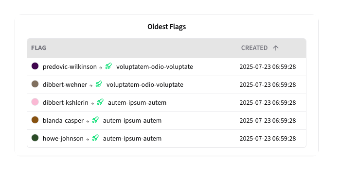

A list of the oldest flags.
