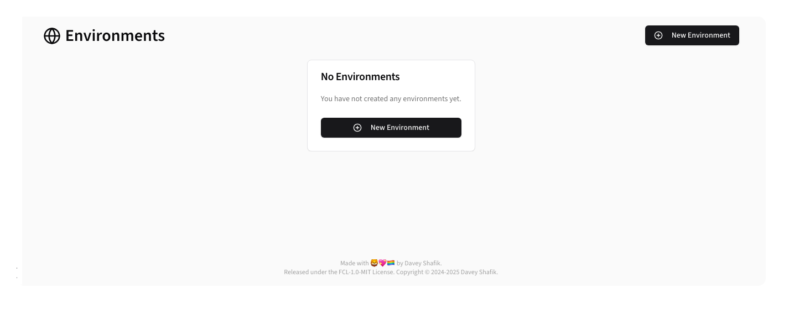
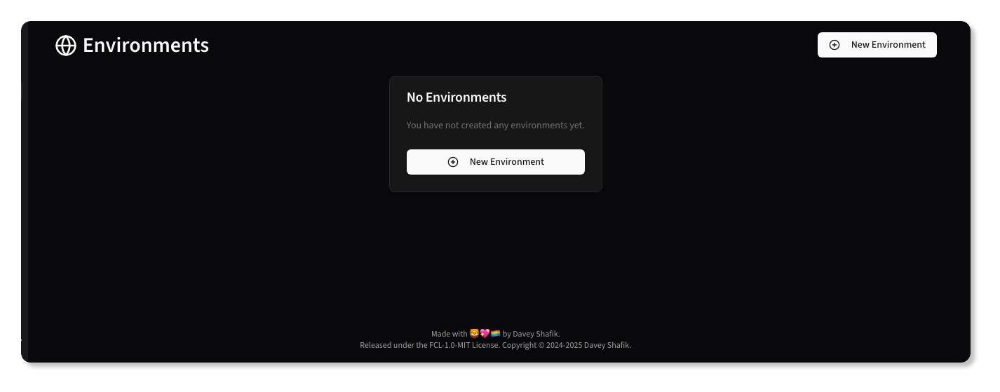
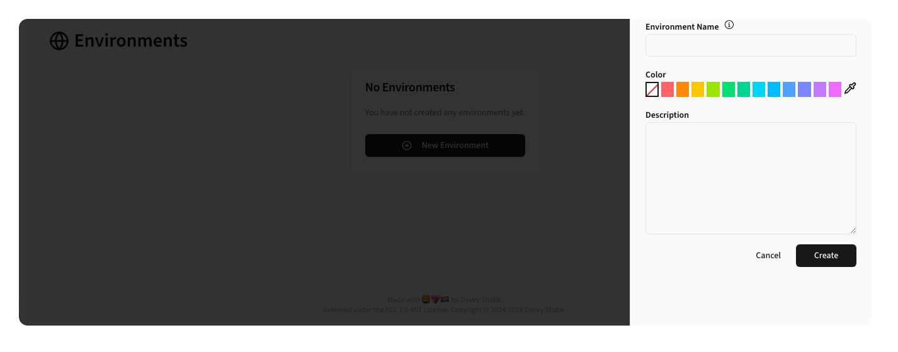
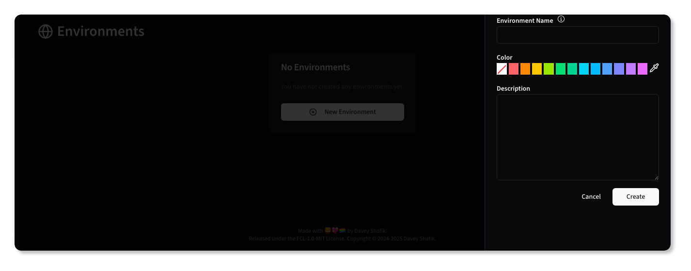
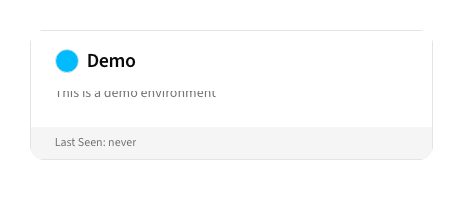
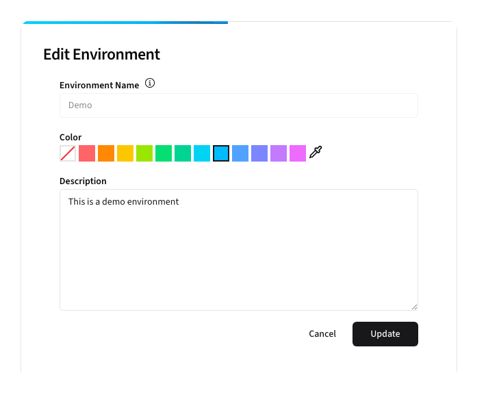
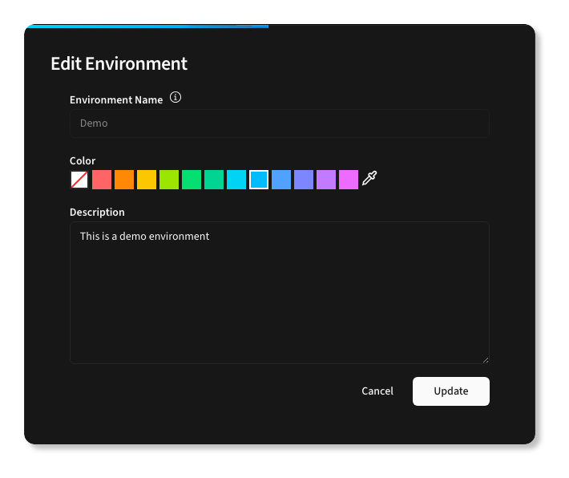

# Environments

The Environments section manages different deployment environments (development, staging, production, etc.) where feature flags are evaluated and used.

## Overview

{.light-only}
{.dark-only}

## Creating Environments

{.light-only}
{.dark-only}

**Form Fields:**
- **Name**: Unique environment identifier, typically the same as your `APP_ENV`.
- **Color**: A color to help identify the Environment elsewhere in Beacon
- **Description**: Description of the environment

After creating a new environment, it will show up in the Environment list:

{.light-only}
{.dark-only}

## Editing Environments

To edit an environment, click the card in the list.

{.light-only}
{.dark-only}

> [!NOTE]
> The Environment Name cannot be changed, and must match your applications
> `pennant.stores.beacon.environment_name` configuration setting.

