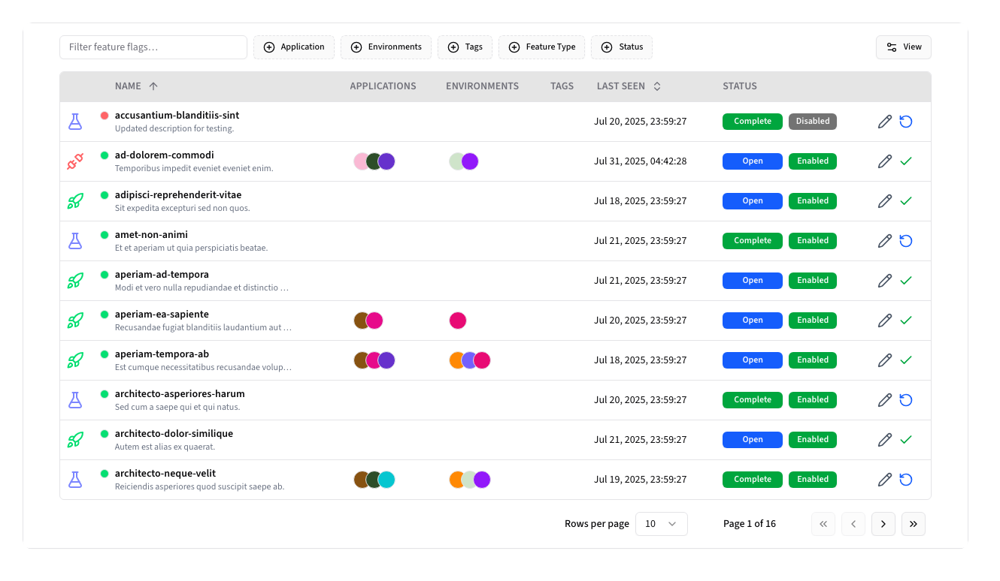
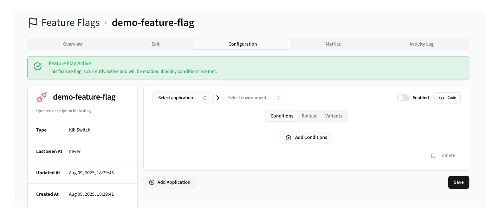
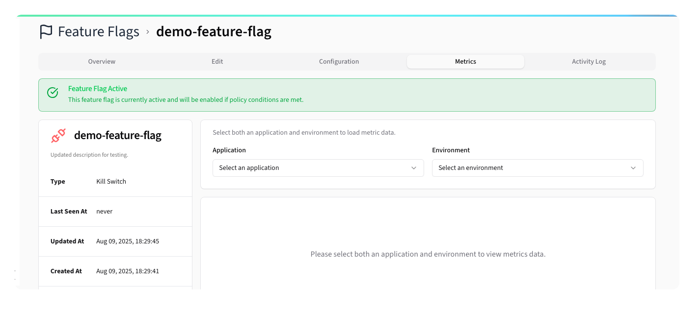

# Feature Flags

The Feature Flags section is the core functionality of Beacon, allowing users to manage, monitor, and configure feature flags across their applications and environments.

*Main feature flags listing page with no feature flags defined*

## Feature Flags Listing

The main interface displays feature flags in a sortable, filterable data table:

**Table Columns:**
- **Flag Name**: Display name with feature type icon and global status indicator
- **Application**: Associated application with color indicator
- **Environment**: Target environment
- **Status**: Current active/inactive state
- **Last Seen**: Last usage timestamp
- **Actions**: Edit and Complete/Open

**Available Filters:**
- **Applications**: Filter by specific applications
- **Environments**: Filter by environment
- **Feature Types**: Filter by flag type
- **Tags**: Filter by assigned tags
- **Status**: Active/Complete state filter
- **Search**: Text search across flag names and descriptions

## Creating Feature Flags

Clicking the <kbd><CirclePlus /> New Feature Flag</kbd> button opens a side sheet for flag creation:

**Form Fields:**
- **Name**: Unique identifier for the flag
- **Description**: Detailed description of the flag's purpose
- **Feature Type**: Category/type selection with icons
- **Tags**: Assignable tags for organization
- **Status**: Initial active/inactive state

## Configuring Feature Flags

Clicking on a Feature Flag opens a detail view:

*Feature Flag Overview*

### Editing Feature Flags

Clicking the <kbd>Edit</kbd> tab will let you edit the flags basic details:

*Feature Flag Edit Form*

Here you can set the global status, change the Feature Flag Type, edit the description,
and manage tags.

### Configuring Policies

A flag's Configuration defines whether a feature flag is active or not. Each Application/Environment must have
its own policy configuration, otherwise the flag will not be active in that context.

At its most basic, a policy simply has an active status, but you can also specify a
series of conditions that must also be met for the flag to be active.

#### Conditions

Conditions are used to define if a feature flag should be active for a given request. You can set conditions based on the [Beacon Context](../core/context) or the current date/time.

For more details on how to configure conditions, see the [Policies documentation](policies.md).

#### Rollout

A flag's Rollout configuration allows you to control the percentage of users that will see the feature flag as active. This is useful for gradual rollouts or simple A/B testing.

The Rollout configuration is applied in _addition_ to the flag's conditions, meaning that if the conditions are met, the rollout percentage will determine if the flag is active for that request.

The control the rollout, set the percentage to the percentage of users that should see the flag as active. For example, setting it to `50%` means that 50% of users will see the flag as active, while the other 50% will not.

Additionally, you can specify the Stickiness behavior, which determines how the rollout behaves for a user across multiple requests.

> [!TIP]
> It is recommended to set the Stickiness behavior to <kbd>Sticky</kbd>. Using a consistent value for a user — such as the user ID or email — ensures a consistent experience for users across requests, preventing them from seeing the flag as active and inactive in quick succession.

#### Variants

Variants allow you to define different values for a feature flag, enabling A/B testing or feature toggling with multiple options.

Each variant has a type, a value, and a weight percentage that determines how often it will be returned when the flag is active. 

You must have at least two variants, and the total weight of all variants must equal 100%.

To evenly distribute variants, you can click the <kbd>Distribute Evenly</kbd> button, which will automatically set each variant's weight to an equal percentage.

Similar to the [Rollout configuration](#rollout), you can specify the Stickiness behavior, which determines how the variant behaves for a user across multiple requests.

### Metrics

*Feature Flag Metrics*

The Metrics tab provides insights into the number of evaluations for a given flag,
and the status of the flag.

Additionally, you can see the number of times each variant was returned and the percentage
of users that saw each variant.

