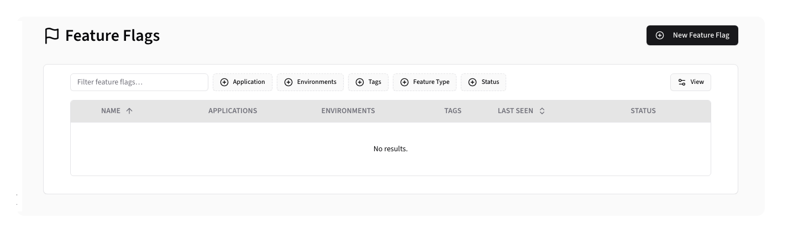
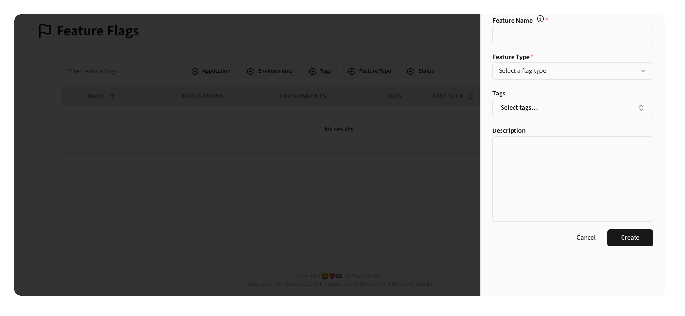
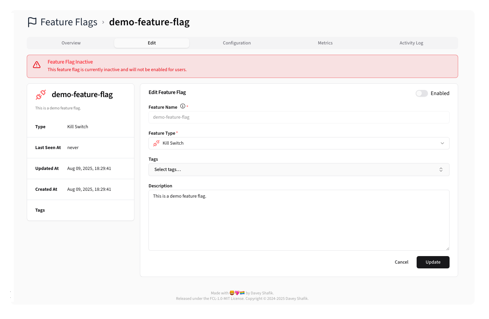

# Feature Flags

The Feature Flags section allows users to manage, monitor, and configure feature flags across their applications and
environments.

## Feature Flags Listing

Beacon lists feature flags in a sortable, filterable table:

**Columns:**

- **Flag Name**: Display name with feature type icon and global status indicator
- **Application**: Associated application with color indicator
- **Environment**: Target environment
- **Status**: Current active/inactive state
- **Last Seen**: Last usage timestamp
- **Actions**: Edit and Complete/Open

**Available Filters:**

- **Applications**: Filter by specific applications
- **Environments**: Filter by environment
- **Feature Types**: Filter by flag type
- **Tags**: Filter by assigned tags
- **Status**: Active/Complete state filter
- **Search**: Text search across flag names and descriptions

## Creating Feature Flags

Clicking the <kbd><CirclePlus /> New Feature Flag</kbd> button opens a side sheet for flag creation:

**Form Fields:**

- **Feature Name**: Unique identifier for the flag
- **Description**: Detailed description of the flag's purpose
- **Feature Type**: Feature Type
- **Tags**: Select Tags to organize your Feature Flags

## Managing Feature Flags

Clicking on a Feature Flag's <Pencil /> icon opens a detail view:

### Editing Feature Flags

Clicking the <kbd>Edit</kbd> tab will let you edit the flags basic details:

Here you can set the global status, change the Feature Flag Type, edit the description,
and manage tags.

> [!TIP]
> The global status is a single place where you can control the Feature Flag status across all configured applications.
>
> - When the global status is **disabled**, the Feature Flag is disabled in all applications and environments.
> - When the global status is **enabled**, the Feature Flag is enabled in all configured applications and environments
    that are _also_ active.

### Configuring Policies

A flag's Configuration defines whether a feature flag is active or not. Each Application and Environment must have
its own policy configuration, otherwise the flag will not be active in that context.

At its most basic, a policy simply has an active status, but you can also specify a
series of conditions that must also be met for the flag to be active.

#### Conditions

Conditions are used to define if a feature flag should be active for a given request. You can set conditions based on
the [Beacon Context](../../core/context.md) or the current date/time.

For more details on how to configure conditions, see the [Policies documentation](policies.md).
