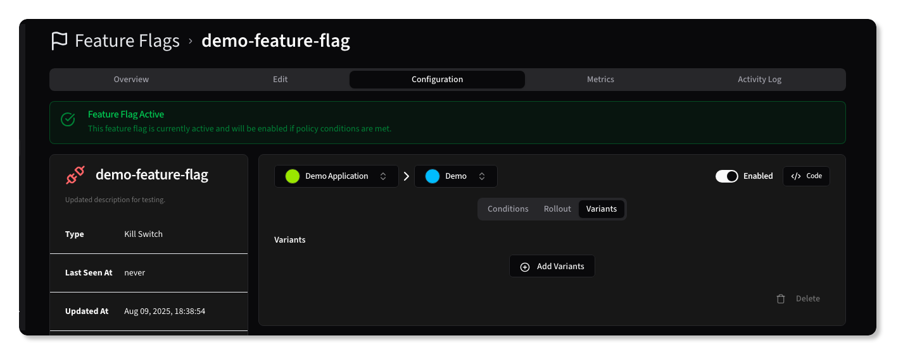
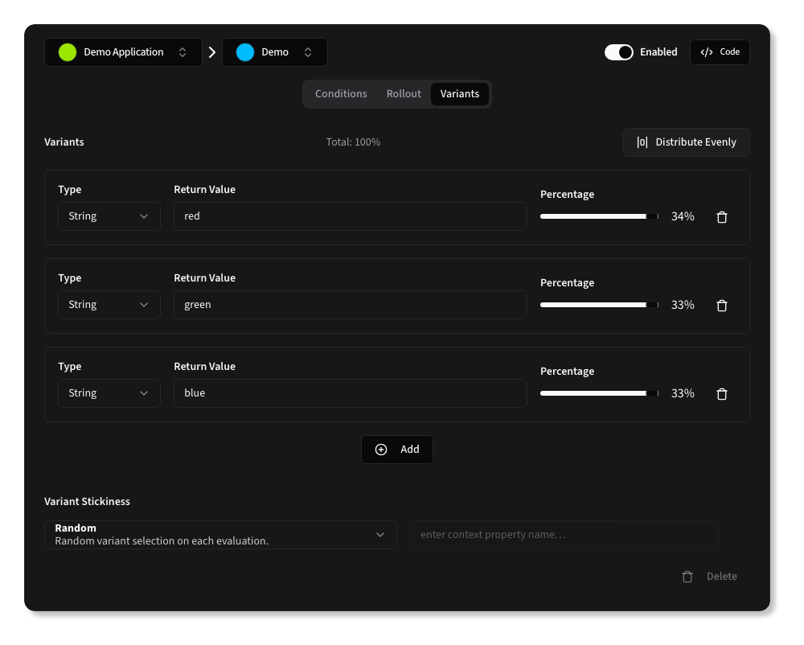

# Multi-Variant Experiments

{.light-only}
{.dark-only}

Variants allow you to define different values for a feature flag, enabling A/B testing or feature toggling with multiple options.

Each variant has a type, a value, and a weight percentage that determines how often it will be returned when the flag is active.

You must have at least two variants, and the total weight of all variants must equal 100%.

To evenly distribute variants, you can click the <kbd><AlignHorizontalSpaceAround /> Distribute Evenly</kbd> button, which will automatically set each variant's weight to an equal percentage.

Similar to the [Rollout configuration](#rollout), you can specify the Stickiness behavior, which determines how the variant behaves for a user across multiple requests.

{.light-only}
{.dark-only}
