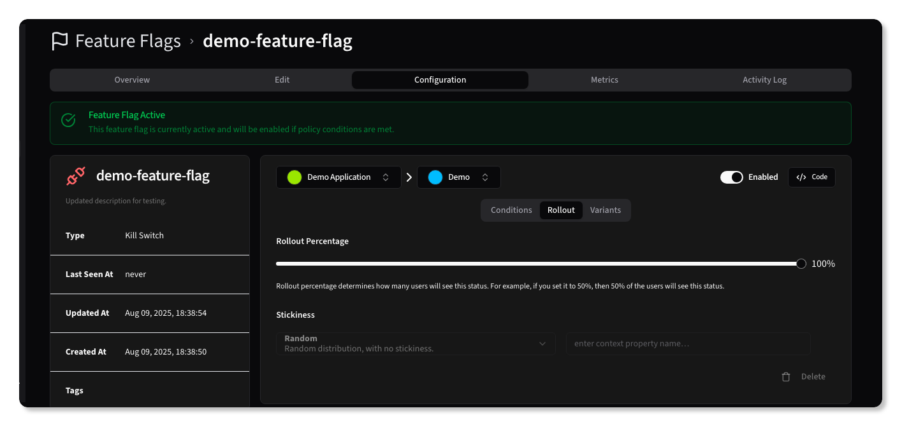
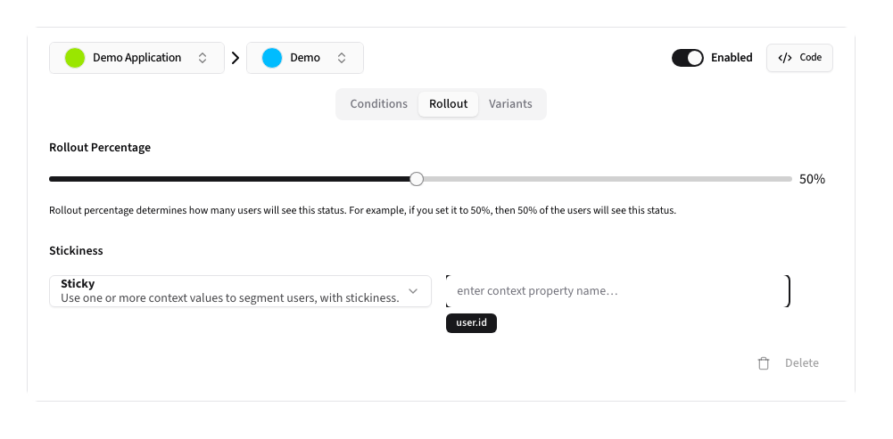

# Rollouts

{.light-only}
{.dark-only}

A Feature Flag's Rollout configuration allows you to control the percentage of users that will see the feature flag as
active. This is useful for gradual rollouts or simple A/B testing.

The Rollout configuration is applied in _addition_ to the flag's conditions, meaning that if the conditions are met, the
rollout percentage will further determine if the flag is active for that request.

To control the rollout, set the <kbd>Rollout Percentage</kbd> to the percentage of users that should see the flag as **active**. For example,
setting it to `60%` means that 60% of users will see the flag as active, while the other 40% will not.

{.light-only}
{.dark-only}

Additionally, you can specify the Stickiness behavior, which determines how the rollout behaves for a user across
multiple requests.

> [!TIP]
> It is recommended to set the Stickiness behavior to <kbd>Sticky</kbd>. Using a consistent value for a user — such as
> the user ID or email — ensures a consistent experience for users across requests, preventing them from seeing the flag
> as active and inactive in quick succession.
