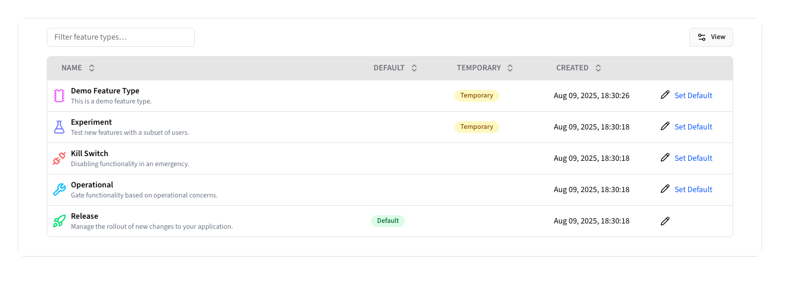
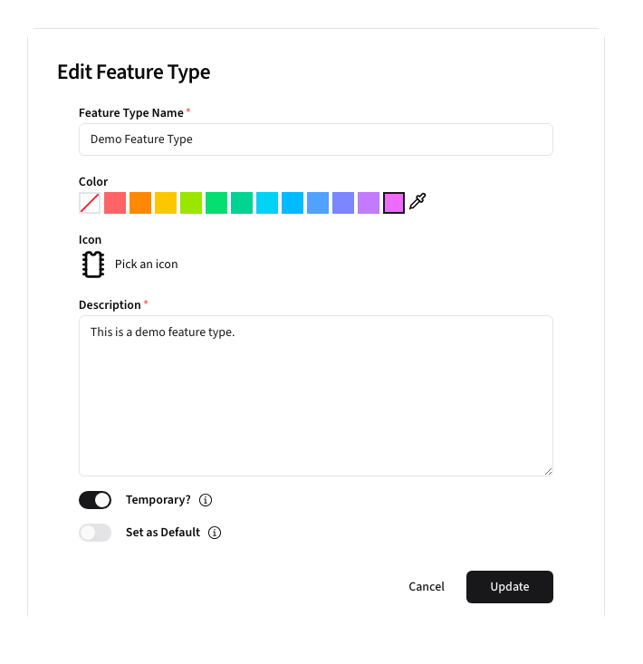

# Feature Types

Feature Types allow you to group Feature Flags by their intended functionality.

## Overview

Feature Types provide a way to categorize feature flags based on their purpose or behavior. Each
feature type has its own name, icon, and color to make it easier to identify what the intended purpose
of a given Feature Flag is.

By default, Beacon provides the following four Feature Types:

| Icon                                       | Feature Type    | Usage                                           | Example                                          | Temporary? |
|--------------------------------------------|-----------------|-------------------------------------------------|--------------------------------------------------|------------|
| <Rocket class="stroke-green-400" />        | **Release**     | Manage new feature rollouts                     | Rolling out a new Dashboard                      | ✅          |
| <Wrench class="stroke-sky-400" />          | **Operational** | Enable/disable features for operational reasons | Disable new user registration during maintenance | ❌          |
| <Unplug class="stroke-red-400" />          | **Kill Switch** | Disable features when they are failing          | A feature using an API that is failing           | ❌          |
| <FlaskConical class="stroke-indigo-400" /> | **Experiment**  | A/B Testing                                     | Measure users preference for similar experiences | ✅          |

> [!NOTE]
> Only Feature Types that are marked as Temporary are included in stale and inactive flag lifecycle metrics. 

## Creating Feature Types

To create a new Feature Type, click the <kbd><CirclePlus /> New Feature Type</kbd> button.

**Form Fields:**
- **Name**: Unique feature type identifier
- **Color**: A color to help identify the Feature Type elsewhere in Beacon
- **Icon**: An icon to help identify the Feature Type elsewhere in Beacon
- **Description**: Description of the feature type
- **Temporary?**: Whether the Feature Flags of this Type are temporary
- **Set as Default**: Whether to use this Feature Type as the type when creating a new Feature Flags via Pennant

After creating a new feature type, it will show up in the Feature Type list:

## Editing Feature Types

To edit a feature type, click the <Pencil /> button for the Feature Type. 

