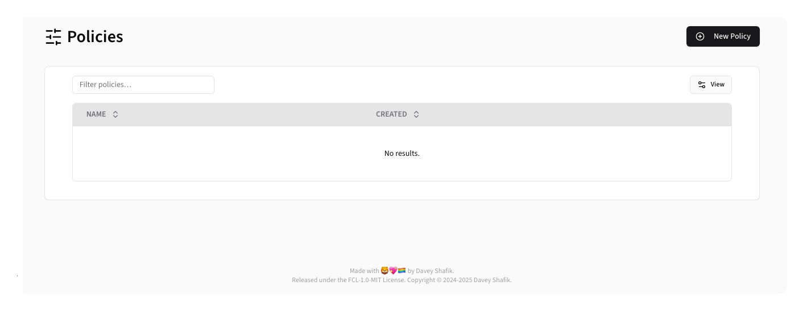
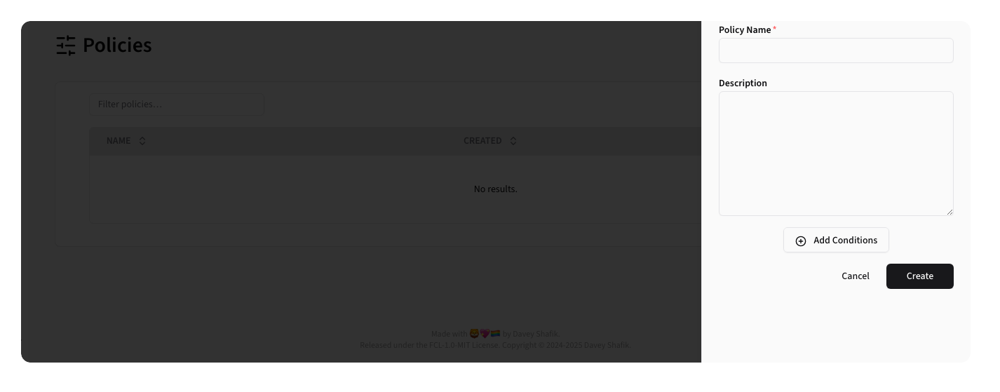
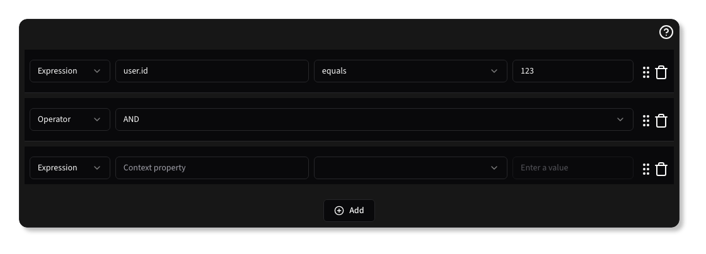

# Policies

Policies are used to define the conditions under which a feature is active. Policies can
be created as re-usable sets of conditions, and they function exactly as if they were created within a feature flag
directly.

> [!TIP]
> For in-depth details of how a policy is structured, review the [Core Policies documentation](../core/policies).

{.light-only}
{.dark-only}

## Creating a Policy

To create a new policy, click the <kbd><CirclePlus /> New Policy</kbd> button.

{.light-only}
{.dark-only}

## Editing a Policy

To Edit a policy, click the <Pencil /> edit button next to the policy you want to modify.

{.light-only}
{.dark-only}

## Adding Conditions to a Policy

Policy Conditions can be one of the following:

* Expression: A comparison expression that is applied to the [Beacon Context](../core/context).
* Policy: A reference to another Policy that is included in this Policy.
* Date/Time: A date or time condition that must be met.
* Operator: A logical operator that combines multiple other condition types.

### Expression Conditions

Expression conditions allow you to define a condition based on the Beacon Context.

To use an Expression, set the <kbd>Type</kbd> to <kbd>Expression</kbd>, then enter a Context property, choose an [Operator](../core/policies#Operators), and enter one or more values to compare the Context value against.

{.light-only}
{.dark-only}

> [!TIP]
> Use Laravel's dot-notation to reference nested properties in the Beacon Context.

### Policy Conditions

Policy conditions allow you to include another Policy within the current Policy. This is useful for re-using common conditions across multiple Policies.

Policy conditions are inlined, meaning that the conditions of the referenced Policy are evaluated as part of the current Policy.

{.light-only}
{.dark-only}

> [!INFO]
> You cannot choose a Policy that references the current Policy, as this would create an infinite loop.

To use a Policy, set the <kbd>Type</kbd> to <kbd>Policy</kbd>, then select the Policy you want to include from the dropdown.

### Date/Time Conditions

Date/Time conditions allow you to specify a condition based on a specific date or time.

To use a Date/Time condition, set the <kbd>Type</kbd> to <kbd>Date/Time</kbd>, then enter a Context property, choose an [Operator](../core/policies#Operators-1), and choose a date and/or time value to compare the Context value against.

{.light-only}
{.dark-only}

### Operator Conditions

Operator conditions allow you to combine multiple other condition types using logical operators.

To use an Operator condition, set the <kbd>Type</kbd> to <kbd>Operator</kbd>, then select the logical operator you want to use (AND, OR, AND NOT, XOR).

{.light-only}
{.dark-only}

> [!WARNING]
> Operators should only be used between two other conditions. Trailing operators will be ignored.

Using Operator conditions, you can combine multiple conditions together to create complex policies:

{.light-only}
{.dark-only}
