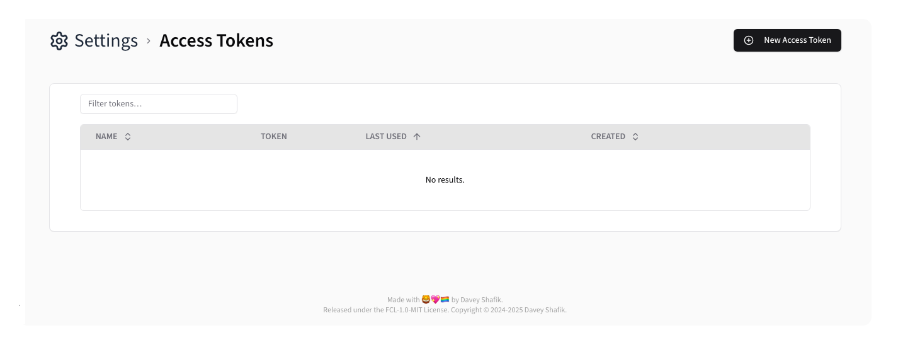
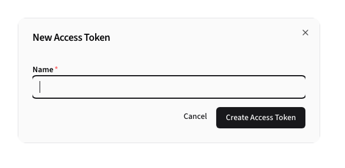
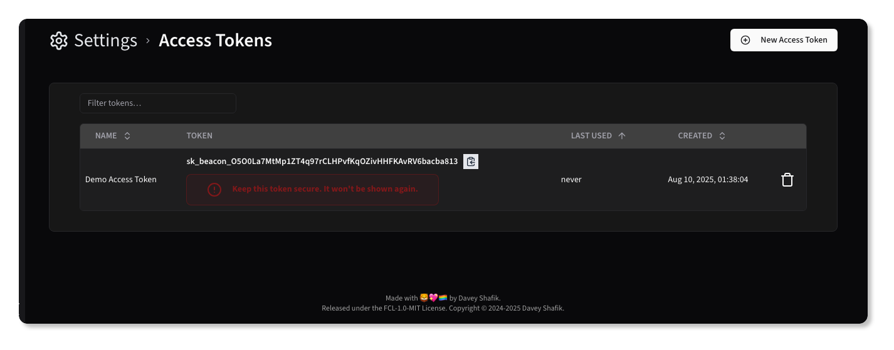
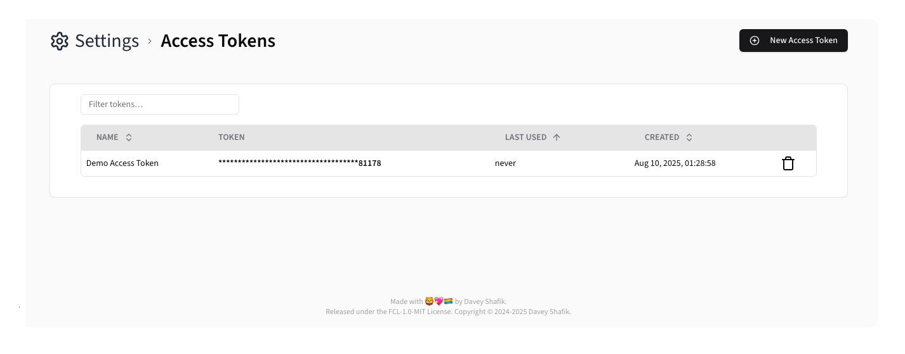

# Access Tokens

The Access Tokens section manages API authentication tokens that allow applications and services to securely interact with the Beacon feature flag system.

## Overview

Access tokens provide secure, programmatic access to the Beacon API.

{.light-only}
{.dark-only}

## Creating a Token

To create a new access token, click the <kbd><CirclePlus /> Create Token</kbd> button. This opens a form to define the new token:

{.light-only}
{.dark-only}

Once you create the token, it will be displayed in the token list with its details.

{.light-only}
{.dark-only}

> [!WARNING]
> This will be your only chance to copy the token value. Make sure to save it securely, as it will not be shown again.

Once you leave the page, you will only be able to view the token name, and last few characters to identify it:

{.light-only}
{.dark-only}

## Deleting a Token

To delete an access token, click the **Delete** <Trash2 /> button next to the token you wish to remove. A confirmation dialog will appear to confirm the deletion.

{.light-only}
{.dark-only}

Confirm the deletion to remove the token permanently.
