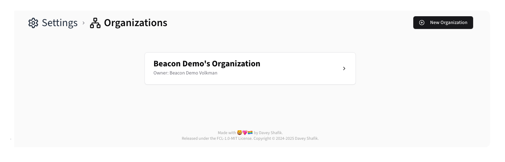
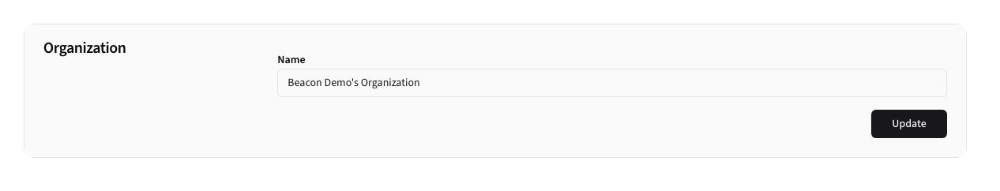

# Organizations

Beacon supports multiple organizations, allowing you to model even the most complex company layouts.

Each organization can have multiple [Teams](./teams), and a user can belong to multiple Organizations and Teams.

## Overview

## Creating Organizations

To create a new Organization, click the <kbd><CirclePlus /> New Organization</kbd> button.

**Form Fields:**

- **Name**: Unique organization identifier.
- **Team Name**: The default team name for the organization.
- **Color**: A color to help identify the Team elsewhere in Beacon.
- **Icon**: An icon to help identify the Team elsewhere in Beacon.

After creating a new organization, it will show up in the Organization list:

## Editing Organizations

To edit an organization, click the card in the list.

## Deleting Organizations

To delete an organization, click the <kbd>Delete Organization</kbd> button at the bottom of the edit form.

You will be prompted to confirm the deletion. This action is irreversible and will delete all associated data.

> [!NOTE]
> Users with access to another organization will still have access, while those that do not will not have access until
> assigned to another organization.

