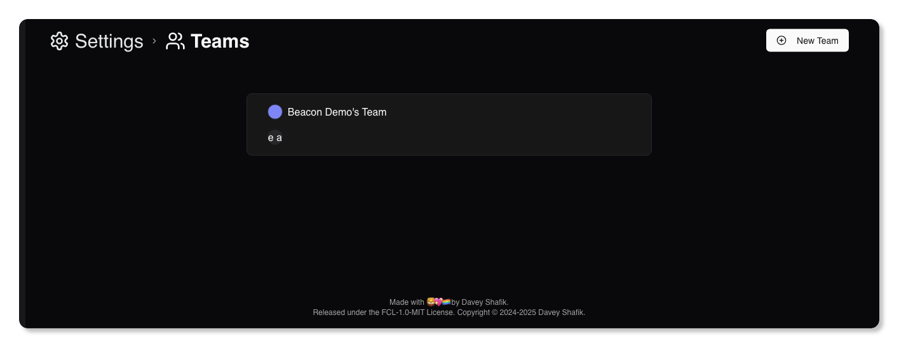
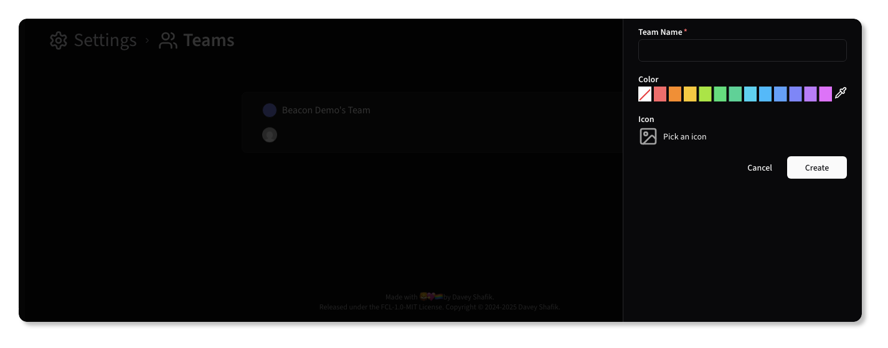

# Managing Teams

Teams in Beacon are used to group users and resources, allowing for better organization and access control. Each team
can have its own set of members and resources, and users can belong to multiple teams.

{.light-only}
{.dark-only}

## Creating a Team

To create a new team, navigate to the <kbd>Teams</kbd> section under <kbd>Settings</kbd>. Click on
the <kbd><CirclePlus /> New Team</kbd> button and fill out the required information:

{.light-only}
{.dark-only}

## Editing a Team

To edit an existing team, click on the team name in the list. This will open the team details page where you can modify
the team name, color, icon, and add new members.

{.light-only}
{.dark-only}

## Adding Members to a Team

To add existing members to a team, navigate to the team details page and click on the <kbd><CirclePlus /> Add Member</kbd> button.

> [!NOTE]
> To add new users to a team, you must first invite them to the Organization. Once they accept the invitation, you can add them to any team within that Organization.

{.light-only}
{.dark-only}

Once you select a user, click the <CircleMinus /> button to remove them:

{.light-only}
{.dark-only}

Click the <kbd>Add</kbd> button to confirm the addition of the member to the team.

## Removing Members from a Team

{.light-only}
{.dark-only}

To remove a member from a team, navigate to the team details page and click on the <Trash2 /> button next to the member's name. Confirm the removal when prompted.

{.light-only}
{.dark-only}

