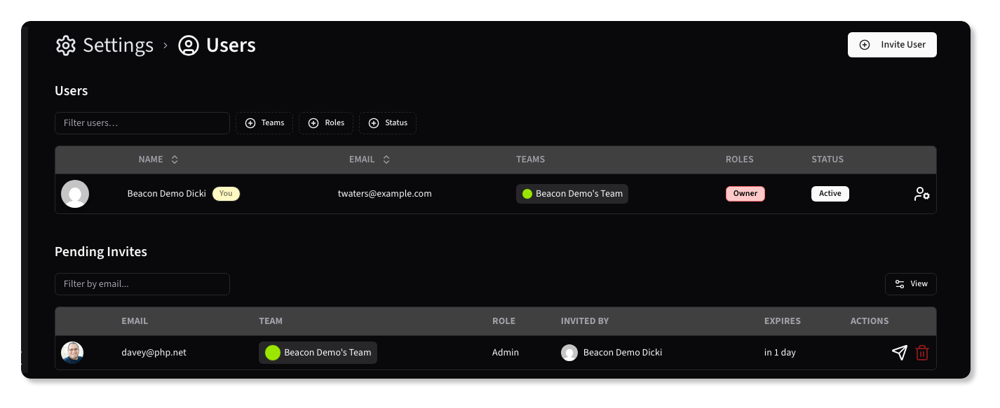

# Managing Users

Beacon supports role-based access control (RBAC) to manage user permissions. Users can be assigned to different roles, each with specific permissions that control what actions they can perform within the application.

While any user can [create an account](../basics/registration), they must be invited to join an organization or team to access those resources.

{.light-only}
{.dark-only}

## Permissions Hierarchy

All users are associated with one or more organizations and teams, and can be assigned a single role within each team.

Access to resources is determined by the following hierarchy:

## Roles

Beacon supports the following roles:

- **Owner**: Full access to all resources and settings across all Organizations and Teams.
- **Admin**: Full access to all resources and settings across all Organizations and Teams to which they themselves belong.
- **Developer**: Can create and manage resources within the Teams they belong to, but cannot manage Organizations, Teams, or users.
- **Biller**: Can view billing information and manage payment methods, but cannot access or modify resources.

## Inviting New Users

To add a new user, navigate to the <kbd>Users</kbd> section under <kbd>Settings</kbd>. You can only invite users to the _current_ Organization. To invite users to another Organization, you must first switch to that Organization using the Organization dropdown in the top-right corner of the screen. 

Click on the <kbd><CirclePlus /> Invite User</kbd> button and fill out the required information:

* **Email**: The email address of the user you want to invite.
* **Role**: The role to assign to the user within the organization or team.
* **Team**: The team to which the user will be added.

Once the user accepts the invitation, they will be able to access resources associated with the selected team.

> [!TIP]
> After the user accepts the invitation, you will be able to add them to additional teams if needed.

{.light-only}
{.dark-only}

Once the form is submitted, the user will receive an email invitation to join the organization and team. Invitations are valid for 1 day.

## Pending Invitations

{.light-only}
{.dark-only}

Pending invitations are listed in the <kbd>Pending Invitations</kbd> section. You can resend or cancel invitations as needed using the <Send /> and <Trash2 class="text-red-500" /> buttons, respectively.

## Accepting an Invitation

When a user receives an invitation, they can accept it by clicking the link in the email. This will direct them to the Beacon application where they can create an account:

{.light-only}
{.dark-only}

If the user already has an account, they can log in with their existing credentials:

{.light-only}
{.dark-only}

## Editing a User

To edit a user's details, click on the Edit <UserCog /> button next to their name in the user list. You can change their role, active status, team assignments, and reset their password and 2FA settings.

{.light-only}
{.dark-only}
