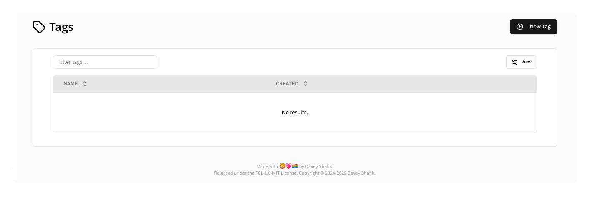
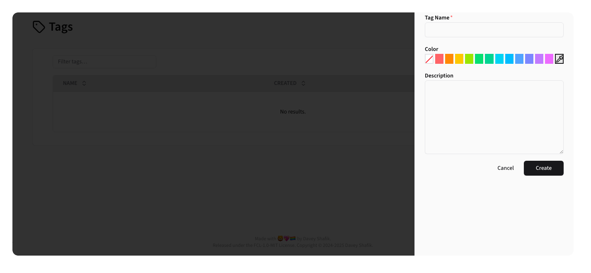

# Tags

The Tags section provides a flexible labeling and organization system for feature flags, enabling better categorization,
filtering, and management across the application.

## Overview

Tags are labels that can be attached to feature flags to provide additional context, organization, and filtering
capabilities. They help teams categorize flags by purpose, team ownership, release cycles, or any other meaningful
classification system.

**Table Columns:**

- **Name**: Tag name with color indicator and description
- **Created**: Creation date
- **Updated**: Updated date (hidden by default)

## Creating a Tag

To create a new Tag, click the <kbd><CirclePlus /> New Tag</kbd> button.

**Form Fields:**
- **Name**: Unique tag identifier
- **Color**: A color to help identify the Tag elsewhere in Beacon
- **Description**: Description of the tag's purpose

After creating a new tag, it will show up in the Tags list:

## Editing Tags

To edit a tag, click the <Pencil /> edit button for the Tag.

