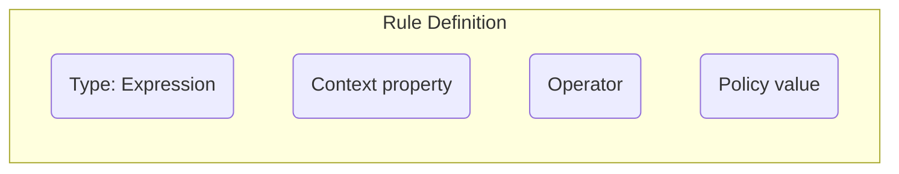
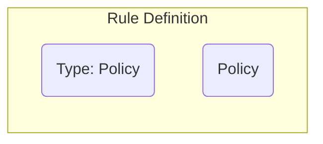
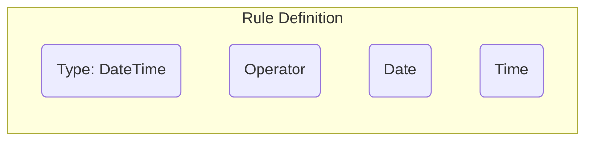
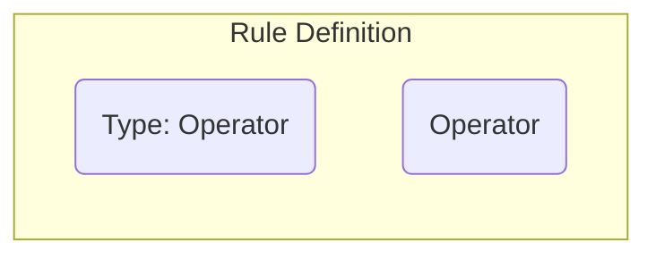

# Policies

Policies are the rule sets that determine if a feature flag is active or not for a given context.

## Policy Structure

Policies are defined as a set of rules against a specific piece of data from the [Context](./context)

There are four types of rules that can be defined within a policy:

### Expressions

Expressions are for matching values within the [Context](./context).

#### Operators

Operators are used to compare the subject against a value.

| Context Value Type | Operator                                               | Policy Value Type | Description                                                                             |
|--------------------|--------------------------------------------------------|-------------------|-----------------------------------------------------------------------------------------|
| scalar             | =                                                      | scalar            | **Context** and **Policy** values are identical                                         |
| scalar             | !=                                                     | scalar            | **Context** and **Policy** values are not identical                                     |
| scalar             | <, <=, >, >=                                           | scalar            | **Context** value is <, <=, >, >= than the **Policy** value                             |
| scalar             | contains exactly, contains any                         | scalar            | **Context** value _contains_ the **Policy** value (as strings)                          |
| scalar             | does not contains exactly, does not contains any       | scalar            | **Context** value _does not contain_ the **Policy** value (as strings)                  |
| scalar             | regex match exactly, regex match any                   | scalar            | **Context** value matches the **Policy** value as regex                                 |
| scalar             | does not regex match exactly, does not regex match any | scalar            | **Context** value does not match the **Policy** value as regex                          |
| scalar             | is one of                                              | scalar            | Unsupported                                                                             |
| scalar             | is not one of                                          | scalar            | Unsupported                                                                             |
| scalar             | =, is one of                                           | array             | **Context** value exists _within_ the **Policy** array                                  |
| scalar             | !=, is not one of                                      | array             | **Context** value does not exist _within_ the **Policy** array                          |
| scalar             | contains exactly                                       | array             | **Context** value _contains all of_ the **Policy** values                               |
| scalar             | contains any                                           | array             | **Context** value _contains one of_ the **Policy** values                               |
| scalar             | does not contains exactly                              | array             | **Context** value is not contained in all of the **Policy** values                      |
| scalar             | does not contains any                                  | array             | **Context** value is not contained in one of the **Policy** values                      |
| scalar             | regex match exactly                                    | array             | **Context** value matches __all__ of the **Policy** values as regex                     |
| scalar             | regex match any                                        | array             | **Context** matches one of the **Policy** array values as regex                         |
| scalar             | does not regex match exactly                           | array             | **Context** value does not match __all__ of the **Policy** values as regex              |
| scalar             | does not regex match any                               | array             | The **Context** value does not match __any__ of the **Policy** values as regex          |
| scalar             | is not one of                                          | array             | **Context** value does not exist _within_ the **Policy** array                          |
| scalar             | <, <=, >, >=                                           | array             | Unsupported                                                                             |
| array              | =                                                      | scalar            | One of the **Context** values is identical to the **Policy** value                      |
| array              | !=                                                     | scalar            | None of the **Context** values are identical to the **Policy** value                    |
| array              | contains exactly                                       | scalar            | All of the **Context** values _within_ the **Policy** value (as strings)                |
| array              | does not contain exactly                               | scalar            | All of the **Context** values do not exist _within_ the **Policy** value (as strings)   |
| array              | contains any                                           | scalar            | One of the **Context** values exists _within_ the **Policy** value (as strings)         |
| array              | does not contains any                                  | scalar            | One of the **Context** values does not exist _within_ the **Policy** value (as strings) |
| array              | regex match exactly                                    | scalar            | All of the **Context** Values match the **Policy** value as regex                       |
| array              | does not regex match exactly                           | scalar            | All of the **Context** values do not match the **Policy** value as regex                |
| array              | regex match any                                        | scalar            | One of the **Context** values matches the **Policy** value as regex                     |
| array              | does not regex match any                               | scalar            | One of the **Context** values does not match the **Policy** value as regex              |
| array              | is one of                                              | scalar            | Unsupported                                                                             |
| array              | is not one of                                          | scalar            | Unsupported                                                                             |
| array              | <, <=, >, >=                                           | scalar            | All **Context** values are <, <=, >, >= to the **Policy** value                         |
| array              | =                                                      | array             | **Context** and **Policy** values are identical (ordering ignored)                      |
| array              | !=                                                     | array             | **Context** and **Policy** values are not identical (ordering ignored)                  |
| array              | contains exactly                                       | array             | All **Context** values exist _within_ the **Policy** array                              |
| array              | does not contains exactly                              | array             | All of the **Context** values do not exist _within_ the **Policy** array                |
| array              | contains any                                           | array             | One of the **Context** values exists _within_ the **Policy** array                      |
| array              | does not contains any                                  | array             | None of the **Context** values exist _within_ the **Policy** array                      |
| array              | regex match exactly                                    | array             | All of the **Context** values match _all_ of the **Policy** values as regex             |
| array              | does not regex match exactly                           | array             | All of the **Context** values do not match _all_ of the **Policy** values as regex      |
| array              | regex match any                                        | array             | One of the **Context** values matches _one_ of the **Policy** values as regex           |
| array              | does not regex match any                               | array             | All of the **Context** values do not match _any_ of the **Policy** values as regex      |
| array              | is one of                                              | array             | All of the **Context** values exist _within_ the **Policy** array                       |
| array              | is not one of                                          | array             | All of the **Context** values do not exist _within_ the **Policy** array                |
| array              | <, <=, >, >=                                           | array             | Unsupported                                                                             |

### Policies

You can nest policies within policies. This allows for more complex policies to be defined using composition.

> [!NOTE]
> Beacon will detect recursive policies and disallow them. This is to prevent infinite loops in policy evaluation.

### Date/Time

Date/Time rules are for time-based feature flag activation. They allow you to enable or disable features based on specific dates and times.

The context value is a date/time string that will be parsed and compared against the current time. The supported operators are:

- **less than or equal** (`<=`): Feature is active if current time is before or equal to the specified date/time
- **greater than or equal** (`>=`): Feature is active if current time is after or equal to the specified date/time (default behavior)

#### Examples

**Activate a feature until a specific date:**
- Type: DateTime
- Operator: `<=`
- Context Value: `2025-12-31 23:59:59`

**Activate a feature after a specific date:**
- Type: DateTime  
- Operator: `>=`
- Context Value: `2025-01-01 00:00:00`

### Operators

Operators are used to create boolean expressions between Expressions, Policies, and DateTime rules.

